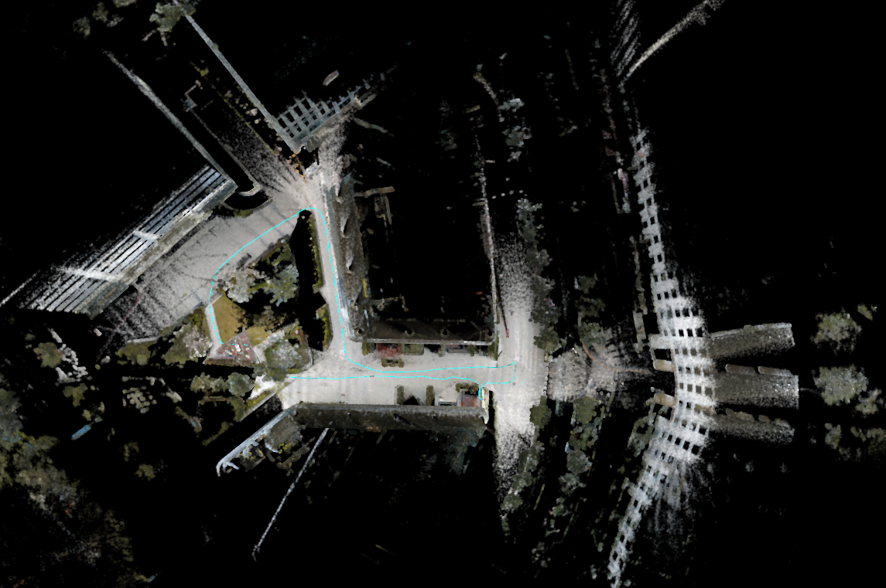

# Livox_Color_View-And-Mpping

A module to color the livox frame and color for FASTLIO2 map, inorder to checkout our extrinsicT

<p align='center'>
    
    
</p>

<p align='center'>
    
</p>

## Related worked

1.感谢[luckyluckydadada](https://github.com/luckyluckydadada) 的 [LIVOX_COLOR](https://github.com/luckyluckydadada/LIVOX_COLOR) 工作 ,Livox_Color_View&Mapping 是基于LIVOX_COLOR进行修改的 。

2.视频参考来源[【自制】尝试Livox Mid40与D435i离线跑fastlio2彩色地图](https://www.bilibili.com/video/BV1MG411n7zd/?spm_id_from=333.999.0.0&vd_source=ed6bf57ee5a8e930b7a857e261dac86d)

## Our PlatForm

| Lidar       | Camera | Computer    |
| ----------- | ------ | ----------- |
| Livox mid70 | D435i  | Intel NUC11 |

## Contributions

**Livox_Color_View**：调用 camera lidar 的外参结果，进行实时单帧点云上色显示。

**FastLio2_Color_Mapping**：订阅FastLio2 输出的/Odometry信息,进行地图上色。

## Prepare work

**外参标定**：使用 [livox_camera_calib](https://github.com/hku-mars/livox_camera_calib)工具进行 lidar to camera 外参标定

**相机内参**：有条件可使用棋盘格进行相机内参标定，本次实验使用的是D435i原厂的相机内参

**SLAM里程计**：里程计订阅FastLio2的里程计信息，进行点云实时渲染上色。

## Prerequisites

- Ubuntu 18.04 and ROS Melodic
- PCL >= 1.8 (default for Ubuntu 18.04)
- Eigen >= 3.3.4 (default for Ubuntu 18.04)
- OpenCV >= 3.3

## Build

```shell
cd YOUR_WORKSPACE/src
git clone https://github.com/kahowang/FAST_LIO_SAM.git
cd ..
catkin_make
```

## Quick test

### 1.Livox_Color_View

读取标定后的结果，进行实时效果查看

```shell
#step0
cd /livox_color_ws
source devel/setup.bash

# step 1 启动livox雷达 注意使用livox数据类型为Pointcloud2
roslaunch livox_ros_driver livox_lidar.launch    

#step2 启动相机获取图像，运行 D435i节点  1280 x 720
roslaunch realsense2_camera rs_camera.launch

#step3 启动
roslaunch livox_color livox_color_view.launch
```

### 2.FastLio2_Color_Mapping		

```shell
#step0
cd /livox_color_ws
source devel/setup.bash

#step1 运行FASTLIO2 , 适配mid70 在FASTLIO2下建图的yaml文件已在本文件夹下
roslaunch fast_lio mapping_mid70_manual.launch

#step2 运行 livox_color_mapping 节点，订阅FASTLIO2里程计
roslaunch livox_color livox_color_mapping.launch

#step3 播放数据集
rosbag play *.bag

#step4 保存地图,地图文件会保存于对应的文件夹中
rosservice call /save_map destination: ''" 
```

### 3.some config

```yaml
#FILE : livox_color_view.yaml && livox_color_mapping.yaml
common:
    lidar_topic:  "/cloud_registered"                  # 订阅FASTLIO2输出点云
    lidar_color_topic:  "/livox/color_lidar"      # 发布彩色点云话题
    odom_topic:  "/Odometry"                             # 订阅FASTLIO2输出里程计
    camera_topic:  "/camera/color/image_raw"   		# 订阅相机话题
    frame_id: "camera_init"                                   # FASTLIO2   Frame_ID

mapping:
    extrinsicT: [ 0.0144457,  -0.999828,  0.0116559,  -0.115962,
                            -0.0142691,  -0.0118621,  -0.999828, -0.0215207,
                            0.999794, 0.0142769,  -0.014438,  -0.0131816,
                            0.0,  0.0,  0.0,  1]        #  lidar2camera 外参  From livox_camera_calib

    intrisicT: [ 913.197692871094, 0, 648.626220703125,
                         913.52783203125, 0, 358.518096923828,
                         0, 0, 1]           # camera 内参

    ditortion: [0, 0, 0, 0, 0]      # camera 畸变系数

savepcd:
    savePCDDirectory: "/livox_color_ws/src/livox_color/PCD/"
    
#FILE:	livox_color_view.cpp && livox_color_mapping.cpp
define Hmax 720						#camera Height
define Wmax 1280				 #camera width 
```

<p align='center'>
    
    
</p>


## Acknowledgements

 In this project, the baseline is from  [LIVOX_COLOR](https://github.com/luckyluckydadada/LIVOX_COLOR) .

 Also thanks [Tomato1107](https://github.com/Tomato1107)    [lovelyyoshino](https://github.com/lovelyyoshino)   [Huang Hongqian](https://github.com/Natsu-Akatsuki)   LeiHe 's great help .
